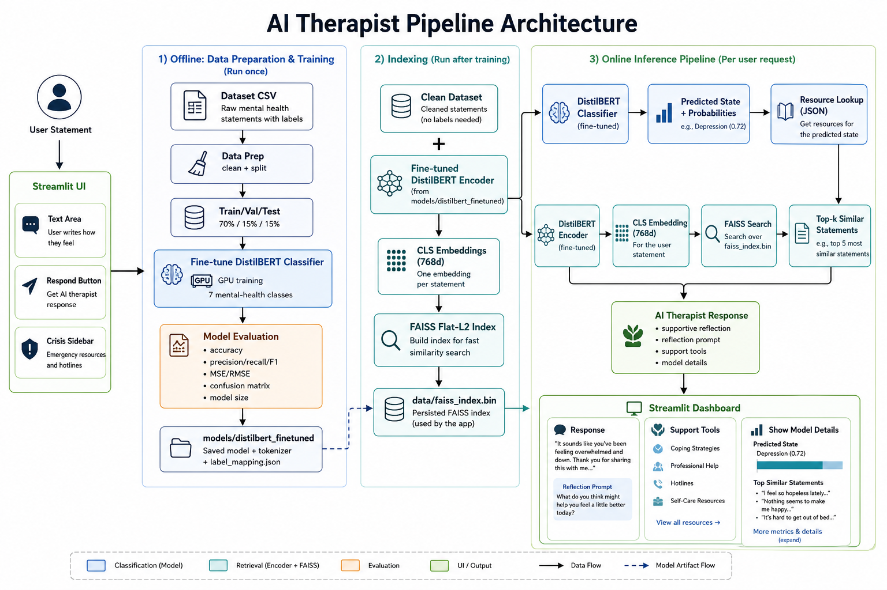
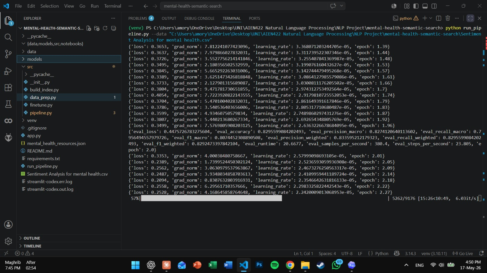
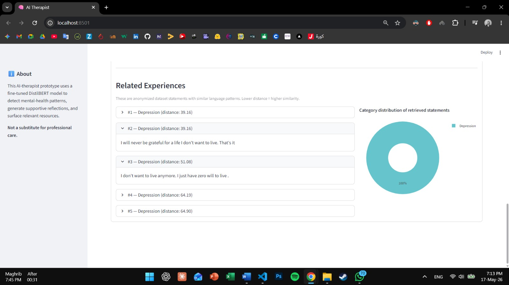

# AI Therapist: Mental Health Classification System

A deep learning-based mental health classification system built with fine-tuned DistilBERT and semantic retrieval using FAISS. This project demonstrates a complete NLP pipeline from data preprocessing through model deployment, achieving 82.7% validation accuracy across 7 mental health categories.

[](https://www.python.org/downloads/)

> **⚠️ Important Disclaimer**: This is an educational prototype for NLP research and coursework. It is **not** a substitute for professional mental health care and should never be used as the sole basis for clinical decisions. 

---

## Overview

This project builds an AI system that can classify mental health statements into seven different categories: **Anxiety**, **Bipolar**, **Depression**, **Normal**, **Personality disorder**, **Stress**, and **Suicidal**. The system uses a fine-tuned DistilBERT transformer model combined with FAISS semantic search to not only classify statements but also retrieve similar examples from the training data and surface relevant mental health resources.

### Key Highlights
- **82.7% validation accuracy** with macro F1 score of 0.813
- **66.9M parameters** — lightweight DistilBERT model
- **Complete pipeline** — data prep, training, evaluation, deployment
- **Semantic retrieval** — FAISS index for finding similar statements
- **Interactive UI** — Streamlit web application

---

## Architecture

The system follows a three-stage pipeline: classification, retrieval, and resource mapping.



**Pipeline Flow:**
1. **Input**: User statement (raw text)
2. **Classification**: Fine-tuned DistilBERT predicts mental health category + confidence scores
3. **Semantic Retrieval**: FAISS searches for top-k similar statements from the dataset using CLS embeddings
4. **Resource Mapping**: Returns curated support resources based on the predicted category
5. **Output**: Predicted state, confidence, similar examples, and mental health resources

---

## Features

### 1. **Multi-Class Classification**
- Classifies statements into 7 mental health categories
- Returns per-class probability distribution
- Confidence scores for predictions

### 2. **Semantic Search**
- FAISS flat L2 index for exact nearest-neighbor search
- 768-dimensional CLS token embeddings from DistilBERT
- Retrieves contextually similar statements with distance metrics

### 3. **Resource Mapping**
- Curated mental health resources mapped to each category
- Crisis hotlines for high-risk categories (Suicidal)
- Coping strategies and support organizations

### 4. **Interactive Web UI**
- Clean, accessible Streamlit interface
- Real-time classification and retrieval
- Visualization of model confidence and similar statements
- Always-visible crisis support sidebar

### 5. **Comprehensive Evaluation**
- Per-class metrics (precision, recall, F1)
- Confusion matrix analysis
- Training/validation curves
- Model size and parameter count

---

## Dataset

**Source**: [Kaggle Mental Health Sentiment Analysis Dataset](https://www.kaggle.com/datasets/suchintikasarkar/sentiment-analysis-for-mental-health)

**Statistics**:
- **Total samples**: ~50,000+ (combined dataset)
- **Training**: 42,380 samples (70%)
- **Validation**: 7,862 samples (15%)
- **Test**: 7,862 samples (15%)

**Class Distribution** (Validation Set):
| Class | Samples | Percentage |
|-------|---------|------------|
| Normal | 2,445 | 31.1% |
| Depression | 2,292 | 29.1% |
| Suicidal | 1,588 | 20.2% |
| Anxiety | 574 | 7.3% |
| Bipolar | 415 | 5.3% |
| Stress | 388 | 4.9% |
| Personality disorder | 160 | 2.0% |

**Preprocessing**:
- Removed null values and short statements (< 5 chars)
- Filtered long statements (> 5000 chars)
- Tokenized with DistilBERT tokenizer (max length: 256 tokens)
- Stratified train/val/test split to preserve class distribution

---

## Model Performance

### Overall Metrics

| Metric | Training | Validation |
|--------|----------|------------|
| **Accuracy** | 97.6% | **82.7%** |
| **Macro F1** | 0.978 | **0.813** |

### Per-Class Performance (Validation)


| Class | Precision | Recall | F1 Score | Support |
|-------|-----------|--------|----------|---------|
| Normal | 0.953 | 0.958 | **0.956** | 2,445 |
| Anxiety | 0.892 | 0.864 | **0.878** | 574 |
| Bipolar | 0.864 | 0.884 | **0.874** | 415 |
| Depression | 0.771 | 0.773 | **0.772** | 2,292 |
| Personality disorder | 0.799 | 0.744 | **0.770** | 160 |
| Stress | 0.723 | 0.755 | **0.739** | 388 |
| **Suicidal** | 0.706 | 0.700 | **0.703** | 1,588 |

### Training Progress



**Key Observations**:
- Model converged quickly: 77% → 83% validation accuracy in first 2 epochs
- Early stopping triggered after epoch 2 when validation F1 plateaued
- Some overfitting present (train: 97.6%, val: 82.7%) due to class imbalance
- No class weighting applied during training

---

## Installation

### Prerequisites
- Python 3.10 or higher
- GPU recommended for training (CPU works but is slow)
- 8GB+ RAM for FAISS index operations

### Step 1: Clone Repository
```bash
git clone https://github.com/YourUsername/mini-ai-therapist.git
cd mini-ai-therapsit
```

### Step 2: Install Dependencies
```bash
pip install -r requirements.txt
```

**Required packages**:
```
transformers>=4.30.0
torch>=2.0.0
faiss-cpu>=1.7.4  # or faiss-gpu for GPU acceleration
pandas>=2.0.0
scikit-learn>=1.3.0
streamlit>=1.25.0
plotly>=5.15.0
numpy>=1.24.0
```

### Step 3: Download Dataset
Download the [Kaggle Mental Health Sentiment Analysis Dataset](https://www.kaggle.com/datasets/suchintikasarkar/sentiment-analysis-for-mental-health) and place `Combined_Data.csv` in the project root directory.

---

## Usage

### Quick Start: Run Full Pipeline
This command runs all three stages (data prep, training, indexing):

```bash
python run_pipeline.py --data Combined_Data.csv
```

**What this does**:
1. **Stage 1**: Cleans data and creates train/val/test splits
2. **Stage 2**: Fine-tunes DistilBERT classifier
3. **Stage 3**: Builds FAISS semantic search index

### Stage-by-Stage Execution

#### Stage 1: Data Preparation
```bash
python -m src.data_prep Combined_Data.csv
```
**Output**: `data/train.csv`, `data/val.csv`, `data/test.csv`, `data/dataset.csv`, `data/metadata.json`

#### Stage 2: Model Fine-Tuning
```bash
python -m src.finetune \
  --train data/train.csv \
  --val data/val.csv \
  --eval-dir model_evaluation
```
**Output**: 
- Model: `models/distilbert_finetuned/`
- Evaluation: `model_evaluation/` (metrics, confusion matrix, training curves)

**Training Configuration**:
- Optimizer: AdamW (learning rate: 5e-5)
- Batch size: 16
- Epochs: 4 with early stopping (patience=2)
- Loss: CrossEntropyLoss
- Metric: Macro F1 (best model selection)

#### Stage 3: Build FAISS Index
```bash
python -m src.build_index \
  --dataset data/dataset.csv \
  --model models/distilbert_finetuned \
  --out data
```
**Output**: `data/embeddings.npy`, `data/faiss_index.bin`

### Launch Web Application
```bash
streamlit run app.py
```
Open your browser to `http://localhost:8501`

---

## Project Structure

```
mini-ai-therapist/
├── src/
│   ├── __init__.py              # Package exports
│   ├── data_prep.py             # Stage 1: Data cleaning & splitting
│   ├── finetune.py              # Stage 2: DistilBERT fine-tuning
│   ├── build_index.py           # Stage 3: FAISS index creation
│   └── pipeline.py              # Inference: classify + retrieve + map
├── data/
│   ├── train.csv                # Training split
│   ├── val.csv                  # Validation split
│   ├── test.csv                 # Test split
│   ├── dataset.csv              # Full cleaned dataset
│   ├── embeddings.npy           # 768d CLS embeddings
│   ├── faiss_index.bin          # FAISS L2 index
│   └── metadata.json            # Dataset statistics
├── models/
│   └── distilbert_finetuned/    # Fine-tuned model checkpoint
│       ├── config.json
│       ├── pytorch_model.bin
│       ├── tokenizer_config.json
│       └── vocab.txt
├── model_evaluation/
│   ├── model_evaluation.json    # Metrics summary
│   ├── model_evaluation.txt     # Human-readable report
│   ├── per_class_metrics.csv    # Precision/recall/F1 by class
│   ├── training_history.csv     # Training logs
│   ├── confusion_matrix.png     # Confusion matrix visualization
│   ├── accuracy_curve.png       # Validation accuracy over epochs
│   └── loss_curve.png           # Train/val loss curves
├── Images/
│   ├── Architecture.png         # System architecture diagram
│   ├── Page1.jpeg               # Per-class performance table
│   ├── Page2.jpeg               # Additional evaluation metrics
│   ├── Page3.jpeg               # Confusion matrix/charts
│   └── Training.jpeg            # Training curves
├── app.py                       # Streamlit web application
├── run_pipeline.py              # Full pipeline orchestrator
├── mental_health_resources.json # Curated support resources
├── requirements.txt             # Python dependencies
└── README.md                    # This file
```

---

## Results & Evaluation


**Key Findings**:
- **Normal class**: Excellent separation (95.6% F1) — minimal confusion
- **Anxiety/Bipolar**: Strong performance (87-88% F1)
- **Depression ↔ Suicidal**: Some confusion between these classes (both involve low mood)
- **Suicidal class**: Weakest performance (70.3% F1, 70% recall) — misses 30% of cases

### Detailed Evaluation Reports

All evaluation artifacts are saved to `model_evaluation/`:
- **JSON summary**: Complete metrics in machine-readable format
- **Text report**: Human-readable summary with model size, metrics, per-class breakdown
- **CSV exports**: Per-class metrics, training history
- **Visualizations**: accuracy curve

---

## User Interface

The system includes a Streamlit-based web application that provides an accessible interface for users to interact with the mental health classification model.




---

## Limitations

### 1. **Critical: Suicidal Class Performance**
- **Recall: 70%** — The model misses 30% of statements indicating suicidal ideation
- This is the most clinically important class but has the weakest performance
- **Root cause**: No class weighting or focal loss applied during training
- **Implication**: System is NOT reliable for crisis detection without human oversight

### 2. **Class Imbalance**
- Personality disorder has only 160 validation samples vs 2,445 for Normal
- Rare classes have insufficient data for robust generalization
- No balancing techniques (SMOTE, class weights) were applied

### 3. **Overlapping Symptoms**
- Depression and Suicidal classes share similar language patterns
- Model struggles to distinguish between long-term depressive symptoms and acute suicidal ideation
- Both conditions involve expressions of hopelessness, sadness, worthlessness

### 4. **No Urgency Detection**
- Model classifies mental health patterns but cannot assess urgency or severity
- A statement like "I've thought about suicide" vs "I'm going to kill myself tonight" both get classified as "Suicidal" with no urgency differentiation
- FAISS retrieval finds similar text, not risk level

### 5. **Limited Dataset Diversity**
- Single dataset source (Kaggle)
- No validation on external datasets
- Unknown demographic representation
- Potential label noise from crowdsourced annotations

### 6. **Not Production-Ready**
- Missing proper crisis escalation protocols
- No integration with emergency services
- No longitudinal tracking or context from previous interactions
- Would require validation by mental health professionals before real-world use

---

## Future Work

### High Priority (Addresses Critical Limitations)
1. **Implement Class Weighting or Focal Loss**


2. **Data Augmentation for Rare Classes**


3. **External Validation**


4. **Ensemble Methods**
